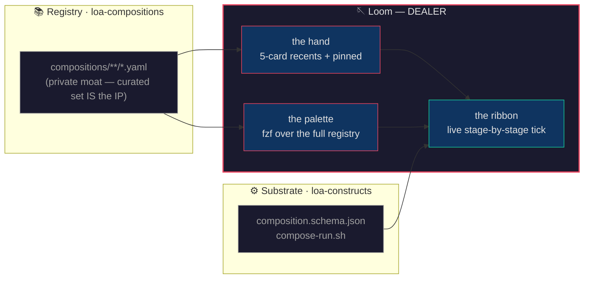

# Loom

*"Pick a card. Press to play. Watch the ribbon."*

Loom is the surface in the Constructs Network where loa-compositions become playable. A spell-book × deck-builder for browsing, composing, and invoking the chains the-weaver authors. The dealer keeps the table; the operator picks the play; compose-run.sh dispatches; the live ribbon ticks stage-by-stage.



---

## Identity

| Attribute | Value |
|---|---|
| **Archetype** | Croupier |
| **Disposition** | Calm under pressure, knows the math, no flourish |
| **Thinking Style** | Procedural — the game is the game |
| **Decision Making** | Deal what's on the table; let the play happen; call the result |
| **Voice** | Matter-of-fact, present continuous. Names the result without spin (✓ or ✗). Uses card-table vocabulary as object handles. Never explains what the player should have done. Banned: 'unfortunately', 'I would suggest', exclamation marks for things that aren't surprises. |
| **Lineage** | John Scarne (*Scarne on Cards*, 1949) → Zach Barth (the-arcade BARTH, ship-or-die) → Vegas table croupiers (no flourish, math wins) |

---

## Expertise

| Domain | Depth | What it covers |
|---|---|---|
| **Composition dispatch** | 5 | Reading the registry · dispatching via compose-run.sh with correct path semantics · tailing orchestrator.jsonl for the live ribbon · operator-private hand state |
| **Game-design framing for tools** | 4 | Deck-builder genre application (BARTH) · spell-book material analog (ALEXANDER) · arcade-quarter UX (<10s cold-open to first play) |

---

## Boundaries

| Does | Does NOT |
|---|---|
| Browse / dispatch / observe compositions | Author NEW compositions (use `the-weaver`) |
| Maintain operator-private hand (recents + pinned) | Validate composition syntax (use `loa-compositions/scripts/validate.sh`) |
| Surface gap-signals when constructs are missing | Curate the registry contents (operator + the-weaver) |
| Render the live ribbon during play | Render a full GUI (CLI/TUI scope only in v1) |

---

## The pipeline (v1)

```
operator types `loom` or `/loom`
                ↓
       🪡 the hand
       (5 cards: recents + pinned)
                ↓
       operator picks (or `loom all` to expand)
                ↓
       🃏 DEALER calls the play · pushes to recents
                ↓
       compose-run.sh dispatches the chain
                ↓
       🎀 ribbon ticks per stage (tail of orchestrator.jsonl)
                ↓
       ✓ or ✗ · run_id called · exit code
```

v1 ships THREE things (BARTH cut):
1. ⌨️ `/` palette with fuzzy search over `compositions/*.yaml`
2. 🎀 live progress ribbon during run
3. 🏠 5-card hand of recents + pinned

Cut to v2: drag-stack composing UI, full grimoire spread, combo detection, badges, meta-decks, sharing, leaderboards, YAML-flip card-back, web/TUI.

---

## Events

```yaml
emits:
  - the-loom.composition.played      # success or failure with run_id + rc + stages
  - the-loom.gap.surfaced            # composition references missing construct → CURATOR
  - the-loom.recipe.pinned           # operator pinned to home view

consumes:
  - the-weaver.flow.authored         # refresh registry view when new composition lands
  - construct.registry.changed       # re-scan when constructs install/uninstall
```

---

## Composes with

| Construct | Relationship |
|---|---|
| **the-weaver** | Sibling — weaver authors flows + emits compositions; loom is where the weaving is browsed and invoked. Pair: weaver weaves, loom is the loom. |
| **the-arcade** | Lineage — BARTH discipline (deck-builder genre, arcade-quarter UX) + OSTROM structural integrity (composition algebra, ECS isolation). |
| **construct-creator** | Gap router — when a played composition references an uninstalled construct, surface to CURATOR via `the-loom.gap.surfaced`. |
| **observer** | When a chain fails mid-stage, KEEPER consumes the trajectory as listening signal. |

See [`construct.yaml`](construct.yaml) for full composition wiring.

---

## Install

```bash
/constructs install the-loom
```

This installs the construct into your local Loa surface. The bin lands at `bin/loom` inside the construct dir; symlink to your PATH:

```bash
ln -sf "$HOME/.loa/constructs/packs/the-loom/bin/loom" "$HOME/.local/bin/loom"
```

(Or whatever PATH-ed dir you prefer.) Verify:

```bash
which loom
loom --help
```

## Bring your own compositions

The lens is public; the registry is yours. Set `LOOM_COMPOSITIONS_DIR` to point at your composition directory:

```bash
export LOOM_COMPOSITIONS_DIR="$HOME/path/to/your/compositions"
loom
```

Default: `~/bonfire/loa-compositions/compositions/` (Honey Jar's private registry).

## Quick start

```
loom               # show the hand (recents + pinned)
loom all           # palette over all compositions
loom <name>        # play it · live ribbon ticks
loom <name> --dry-run  # validate + plan, no LLM cost
loom inspect <name>    # recipe card + full yaml
loom pin <name>        # pin to home view
loom unpin <name>      # remove from pins
loom recents       # invocation history
loom --help        # full usage
```

---

## IP boundary

| Layer | Scope | What it is |
|---|---|---|
| Substrate | **public** | `composition.schema.json` + `compose-run.sh` in `loa-constructs` — anyone can run any composition |
| Lens (this construct) | **public** | The `loom` bin + skill + persona — anyone can install and bring their own compositions |
| Registry | **private** | `loa-compositions/compositions/` is the curated set — that curation IS the IP |

When you fork or install the-loom, you bring your own registry. The lens travels; the moat doesn't.

---

## Provenance

Designed 2026-04-28 by the `composition-grok-surface` team verdict — five expert constructs (BARTH + OSTROM + BEAUVOIR + LEXICOGRAPHER + ALEXANDER) converged on:

- **Layer**: constructs layer (per OSTROM HIGH confidence — substrate stays blind to UX, this is the UX over the Component store)
- **Name**: `the-loom` / `/loom` (per LEXICOGRAPHER — sibling-pair with `the-weaver`)
- **Genre**: deck-builder × spell-book (per BARTH ∩ ALEXANDER)
- **v1 cut**: palette + ribbon + 5-card hand (per BARTH ship-discipline)
- **Persona**: DEALER — operator pick, role-name handle (matches CURATOR/KEEPER/WEAVER convention)

v0 prototype proven end-to-end via `loom audit-feel --dry-run` (schema valid, type-compat verified, exit 0) before construct apprenticeship via `/create-construct`.

---

*Ridden with [Loa](https://github.com/0xHoneyJar/loa).*
